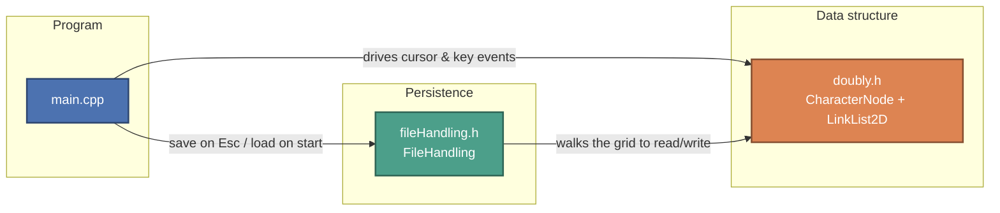
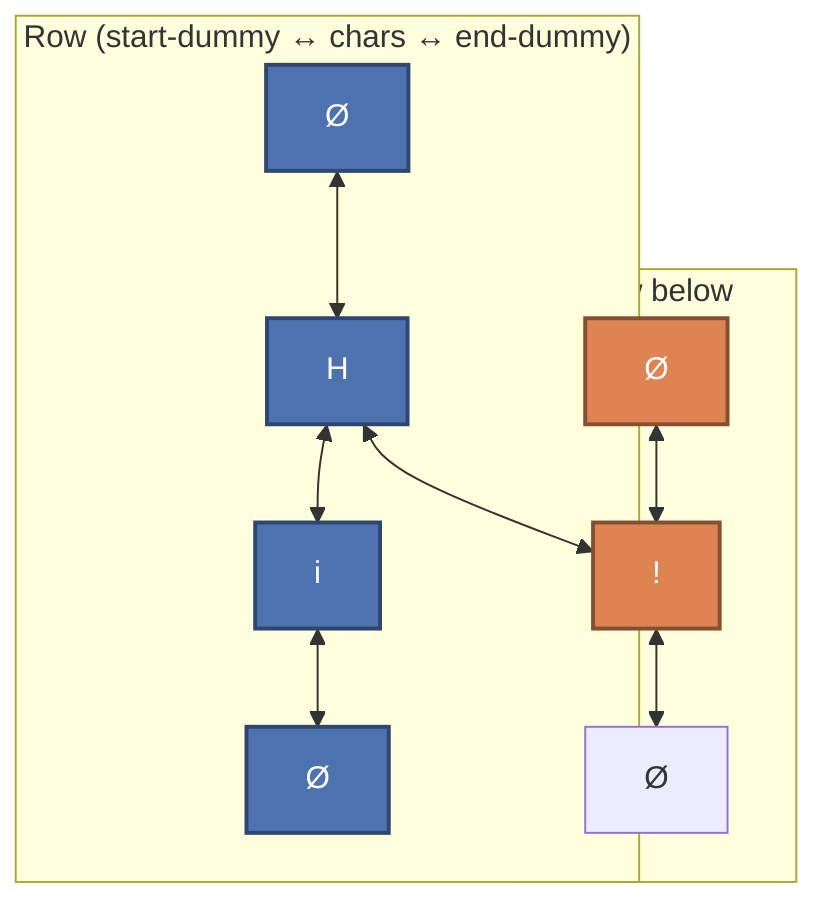
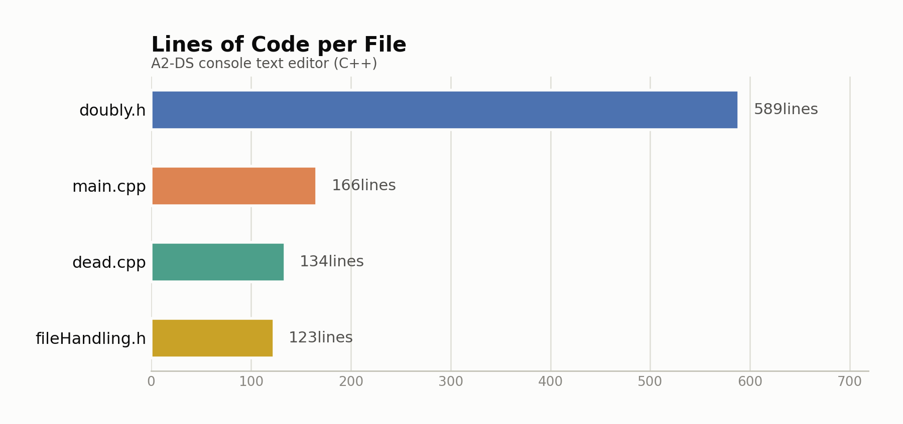

# Console-Based Text Editor

A Notepad-style text editor that runs entirely inside a Windows console window, built on a custom 2D doubly-linked-list of characters instead of strings or arrays.


This was built as a Data Structures course assignment (`A2-DS`): the goal was to implement a working text editor's cursor movement, editing, and persistence using only a hand-rolled linked structure — no `std::string`, no console libraries beyond the Win32 API.

## How it works

Every character typed becomes a `CharacterNode` holding its letter plus `left` / `right` / `up` / `down` pointers. Rows are horizontal chains of nodes (linked `left`/`right`), and each row is stitched to the rows above and below it (linked `up`/`down`) at matching columns, so the whole document is one 2D linked grid rather than a list of line strings. Each row starts and ends with a sentinel "dummy" node (an empty `CharacterNode`) so insertion at the very start or end of a line never needs a null check. A `LinkList2D` class owns the grid: it tracks the current cursor node, keeps the on-screen cursor (via `SetConsoleCursorPosition`) in sync with the node the user is logically "at", and exposes the editing operations below.





*Horizontal links connect a `CharacterNode` to its left/right neighbours in the same row; vertical links connect it to the node sitting in the same column on the row above/below. Dummy nodes bracket each row.*

## Features

Verified directly against `main.cpp` and `doubly.h`:

| Feature | How it's triggered | Implementation |
|---|---|---|
| Insert a letter | Any `A-Z`, `a-z`, or space key | `LinkList2D::addLetter` splices a new `CharacterNode` in between the current node and its right neighbour and re-numbers the columns to its right |
| Delete a letter | `Backspace` | `handleBackspace` blanks the character on screen, then `deleteNode` unlinks the node from its row and column and relinks its neighbours |
| New line | `Enter` | `newLine` creates a fresh start/end dummy pair, links it under the current row, and resets the cursor to column 1 |
| Move cursor | `Arrow Up / Down / Left / Right` | `moveCursorUp/Down/Left/Right` walk the corresponding pointer on the current node (bounded by the input area's width/height) and re-position the console cursor via `gotoxy` |
| Draw the layout | On startup | `drawBoundary` (in `main.cpp`) draws a box of `-`/`|` characters marking the writing area, a "Search" label, and a "Word Suggestion" label region (labels only — no search/suggestion logic is wired up) |
| Save file | `Esc` | `FileHandling::saveFile` walks the grid row by row, column by column, and writes each non-dummy character followed by a newline per row |
| Load file | On editor construction | `FileHandling::readFile` reads the file character by character, calling `list.addLetter()` for normal characters and `list.newLine()` on `\n` — note: this call is present in `fileHandling.h` but is commented out in `main()`, so the current build starts from a blank document even when an existing file is opened |
| Open/create file | Program start | Prompts for a single character, builds a `<char>.txt` filename, and `FileHandling`'s constructor opens it in append mode or creates it if missing |

The console layout is fixed at a default 125×30 (with 169×44 "fullscreen" values noted in a comment but unused), and the writing area is sized to 80% of that.

## `dead.cpp`

`dead.cpp` is listed as a compiled source file in `A2-DS.vcxproj`, but it is genuinely dead code: it defines its own `dead()` function (not `main()`), which is never called from anywhere in `main.cpp`. It contains an earlier, self-contained prototype of the notepad screen (using `std::string` input via `setCursor`/`ddrawBoundary` and `std::getline` instead of the linked-list/console-event approach that shipped), plus a large commented-out draft of an older `addLetter` implementation. It compiles alongside `main.cpp` without conflicting (different entry point) but contributes nothing to the running program.

## `beforedummy.zip`

An earlier snapshot of the four source files (`dead.cpp`, `doubly.h`, `fileHandling.h`, `main.cpp`, dated October 2024) kept as a backup before the dummy-node row/column scheme was introduced into `doubly.h`. It's a leftover draft, not part of the build.

## Lines of code

<picture>
  <source media="(prefers-color-scheme: dark)" srcset="docs/charts/loc-by-file-dark.png">
  
</picture>

## Project structure

```
A2-DS.sln                  Visual Studio solution
A2-DS/
├── main.cpp                Entry point: console event loop, key handling, boundary drawing
├── doubly.h                CharacterNode + LinkList2D — the 2D linked-list editor core
├── fileHandling.h          FileHandling — open/create/read/save the text file
├── dead.cpp                Compiled but unused: an earlier prototype screen (see above)
├── beforedummy.zip         Leftover backup of an earlier draft of the four source files
├── a.txt                   Sample/test text file
├── A2-DS.vcxproj           Visual Studio project file
└── A2-DS.vcxproj.filters   Visual Studio filter/grouping metadata
```

## Prerequisites

- Windows (the editor calls `<Windows.h>` APIs — `SetConsoleCursorPosition`, `ReadConsoleInput` — directly, so it will **not** compile or run on Linux/macOS)
- Visual Studio (2019/2022) with the "Desktop development with C++" workload

## Build & run

1. Open `A2-DS.sln` in Visual Studio.
2. Select a configuration/platform (e.g. `Debug | x64`).
3. Build the solution (`Ctrl+Shift+B`).
4. Run `A2-DS` (`F5` or `Ctrl+F5`) from a console window.
5. Enter a single character when prompted — the editor opens/creates `<character>.txt` and draws the editing area.
6. Type to insert text, use the arrow keys to move around, `Backspace` to delete, `Enter` for a new line, and `Esc` to save and exit.
